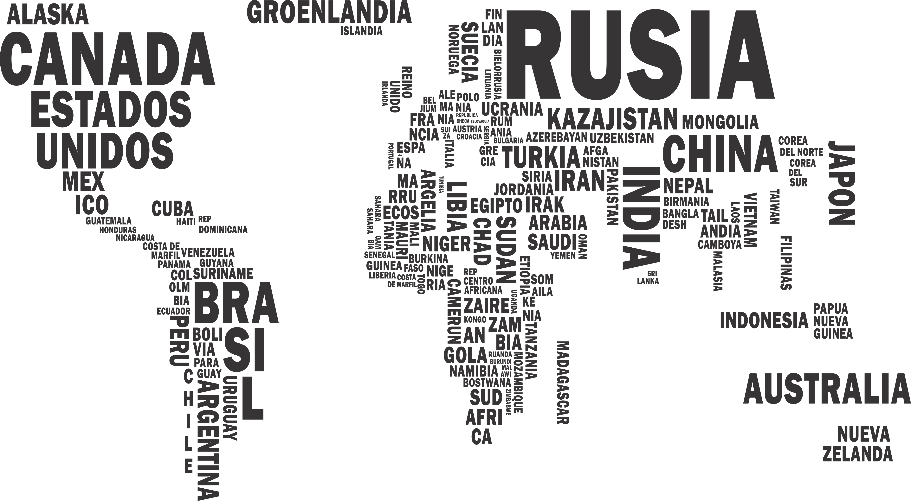

  

## Objetivos del Proyecto

Realizar una App para mostrar paises con su información. Poder ver la card con sus características, realizar ordenamientos, filtrados y paginado. Permite hacer una búsqueda por el searchbar de un país específico, permite crear una actividad turística asignando a uno o varios paises. 
Crear una database la cual se va a utilizar para traer desde una API countries el filtrado de los paises con sus características deseadas. 

#### Tecnologías utilizadas:
- [ ] React
- [ ] Redux
- [ ] Express
- [ ] Sequelize - Postgres
- [ ] NodeJs
- [ ] CSS Modules & Frameworks

